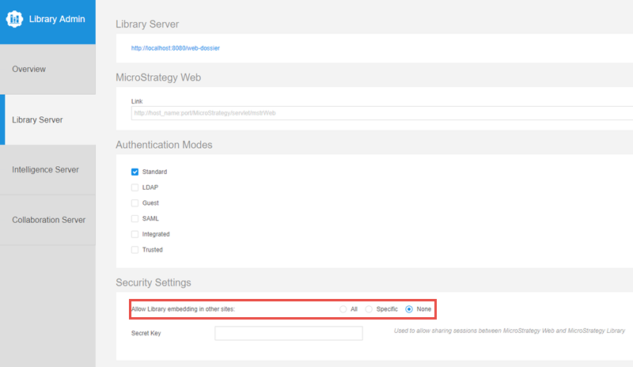

# MicroStrategy Embedding SDK Samples

A collection of samples highlighting functionality and workflows of the Embedding SDK. 

## MicroStrategy Embedding SDK

MicroStrategy Embedding SDK allows you to quickly embed MicroStrategy Dossier into any web application in a responsive manner. It also allows you to control the behavior of your dossier using JavaScript code, such as navigation, filtering, manipulating the interfaces, event handling, etc. 


For more information, please visit the official documentation of [MicroStrategy Embedding SDK](https://lw.microstrategy.com/msdz/MSDL/GARelease_Current/docs/projects/EmbeddingSDK/Content/topics/Intro_to_the_Embedding_SDK.htm). 

### How to get MicroStrategy Embedding SDK?

MicroStrategy Embedding SDK is included in your MicroStrategy Library Server.  You can use it from your web application using a URL like this:


 https://[YOUR Environment]/MicroStrategyLibrary/javascript/embeddinglib.js

## MicroStrategy REST API

MicroStrategy REST API is the backbone of MicroStrategy's open architecture. MicroStrategy REST API is widely used in this project. 

For more information about MicroStrategy REST API, please visit [the official documentation](https://lw.microstrategy.com/msdz/MSDL/GARelease_Current/docs/projects/RESTSDK/Content/topics/REST_API/REST_API.htm) and play with [the live API Explorer](https://demo.microstrategy.com/MicroStrategyLibrary/api-docs/index.html). 


## Feature Showcase

This set of examples demonstrate specific features of Embedding SDK. Open each example to see what is possible with Embedding SDK. Make sure you check the source code for the implementation.

| Features | Examples |
| -----------| --------|
| Dossier page customization,  page navigation, filters, and event handler | [Demo](./feature_showcase/0_Features.html)
| Guest authentication | [Demo](./feature_showcase/1_No_Authentication.html)|
| Guest authentication with multiple modes | [Demo](./feature_showcase/1_2_Guest_With_MultiAuth.html)|
| Authentication with auth token | [Demo](./feature_showcase/2_Use_Auth_Token.html)|
| Authentication with Identity Token | [Demo](./feature_showcase/3_Use_IdentityToken.html)|
| SAML authentication  | [Demo](./feature_showcase/4_Use_SAML.html)|
| SAML authentication 2021 SP2 | [Demo](./feature_showcase/4_Use_SAML_v2021_SP2.html)|
| Custom error handler | [Demo](./feature_showcase/5_ErrorHandling.html)|
| Filter configuration | [Demo](./feature_showcase/6_Filters.html)|
| Using dossier instance ID | [Demo](./feature_showcase/7_Use_Dossier_Instance.html)|
| Customizing the Library Page with URL API | [Demo](./feature_showcase/8_URL_To_LibraryPage.html)|
| Single Visualization | [Demo](./feature_showcase/9_Single_Visualization.html)|
| Panel Stacks | [Demo](./feature_showcase/10_PanelStack.html)|
| Selections on Visualization | [Demo](./feature_showcase/11_Selection.html)|
| Selections on Visualization (Initial Load) | [Demo](./feature_showcase/12_Selection_On_Load.html)|


[Source code](https://github.com/MicroStrategy/embedding-sdk-samples/tree/master/feature_showcase/)

## Library Browsing

This example shows how to build a web page to show all the dossiers and documents in your library.

[Demo](./library_browsing/login.html)

[Document](./library_browsing/)

[Source code](https://github.com/MicroStrategy/embedding-sdk-samples/tree/master/library_browsing)

## Single-Dossier React Application

MicroStrategy Dossier can be used as a standalone application.  This example shows how to build a React-based single-dossier application using MicroStrategy Embedding SDK.

[Demo](./page_navigation/site)

[Document](./page_navigation/)

[Source code](https://github.com/MicroStrategy/embedding-sdk-samples/tree/master/page_navigation)


## More Examples

- View this project at [https://microstrategy.github.io/embedding-sdk-samples/](https://microstrategy.github.io/embedding-sdk-samples/).

- A single-page application with Embedding SDK and REST API and third-party grid library. [Link](https://tutorial.microstrategy.com/Embedding/)

- A multi-tenant demo built on top of 3rd-party JavaScript frameworks. [Link](https://tutorial.microstrategy.com/EmbeddedAnalytics/index.html)


## Other Prerequisites

If you plan to use the samples on a Web page that is on a different domain from your MicroStrategy environment, please also meet the following prerequisites.

### Enable Cross-Origin Resource Sharing (CORS)

Cross-Origin Resource Sharing (CORS) provides a way for a web application running in one origin (domain, protocol, and port) to access selected resources from a server in a different origin. A cross-origin HTTP request uses additional HTTP headers to tell the browser to let the web application share resources. For security reasons, browsers restrict cross-origin HTTP requests initiated from within scripts. This means that when a web application requests HTTP resources from a different origin, the response from the other origin must include the right CORS headers.

To enable CORS for the REST Server:

1. Open the Library Admin page. Your URL should be similar to the following:

    ```
    https://<host_name>:<port>/MicroStrategyLibrary/admin
    ```

2. Navigate to Library Server -> Security Settings.
3. Choose the appropriate setting for Allow Library embedding in other sites to reconfigure CORS.
  


Using the Library Admin page is the easiest way to enable CORS for the REST Server, but you can also configure CORS manually.
1. Navigate to `MicroStrategyLibrary/WEB-INF/classes/config/configOverride.properties`.
2. Edit the configOverride.properties file in a text editor.
3. Add the following lines, or replace them if already present:
    ```
    auth.cors.origins=http://example.com:port
    security.allowedOrigins=http://example.com:port
    ```

4. Restart your MicroStrategy Library web application hosted on the application server.

### SameSite

Google Chrome (version 80+) and Microsoft Edge (version 86+) introduced new changes that may impact embedding.

For Embedding SDK to function as expected in a 3rd party context, it is required to explicitly label session cookies with `SameSite=None; Secure`. 

For more information, see [Chrome v80 Cookie Behavior and the Impact on MicroStrategy Deployments](https://community.microstrategy.com/s/article/Chrome-v80-Cookie-Behavior-and-the-impact-on-MicroStrategy-Deployments?language=en_US).