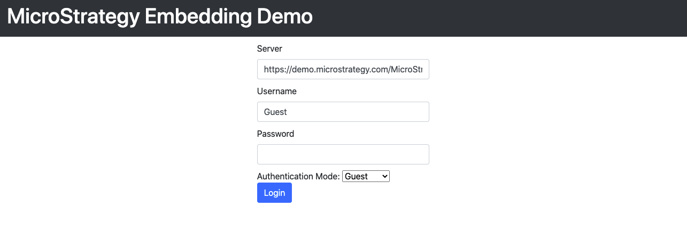

## MicroStrategy REST API Example

This application demonstrates the functionalities of embedding dossier and report. You can also search reports by name. You can see the result in a list view. Report or Dossier will open when you click on it.

### Configuration

API.js is the JavaScript wrapper class for MicroStrategy REST API used by this application. 

The main.js has the business logic for the application. 

You start the application with the login.html, which has a simple login interface. You can change the URL to your MicroStrategy Library for testing. 

### Dossier Embedding

The embeddinglib.js script at the top of the file must be changed to your environment. The dossier table will be populated with all dossiers present in the library of the environment. Clicking an entry will dynamically embed the dossier into the section below.

### Report Embedding

This page shows multiple reports which can be embedded into the page. Users can search reports by name. By clicking on a specific report in the search result table, the report will be dynamically embedded into the page.

### Code Explanation

```fetch()``` method in API.js is to execute MicroStrategy REST API. The response json collected with the help of ```json()``` method. Most of the methods in API.js return a [Promise](https://developer.mozilla.org/en-US/docs/Web/JavaScript/Reference/Global_Objects/Promise). 


### Workflow

The following REST APIs are used in this project. For more information about MicroStrategy REST API, please visit [the official documentation](https://lw.microstrategy.com/msdz/MSDL/GARelease_Current/docs/projects/RESTSDK/Content/topics/REST_API/REST_API.htm) and play with [the live API Explorer](https://demo.microstrategy.com/MicroStrategyLibrary/api-docs/index.html). 


1. [Authenticate a user - Login](https://demo.microstrategy.com/MicroStrategyLibrary/api-docs/index.html?#/Authentication/postLogin)
    
    Authenticate a user and create an HTTP session on the web server where the user's MicroStrategy sessions are stored.
   
    ```http
    POST /api/auth/login
    ```

2. [Get session](https://demo.microstrategy.com/MicroStrategyLibrary/api-docs/index.html?#/Authentication/sessionSessionIdGet) 
    
    Get information about a configuration session.

    ```http
    GET /api/sessions
    ```   

3. [Keep session alive](https://demo.microstrategy.com/MicroStrategyLibrary/api-docs/index.html?#/Authentication/sessionSessionIdPut)

    Extends the HTTP and intelligence Server sessions by resetting the timeouts.

    ```http
    PUT /api/sessions
    ```         
   
4. [Get the library](https://demo.microstrategy.com/MicroStrategyLibrary/api-docs/index.html?#/Library/getLibrary)  
    
    Get the library for the authenticated user.
    
    ```http
    GET /api/library
    ```

5. [Get Quick Search result in a list](https://demo.microstrategy.com/MicroStrategyLibrary/api-docs/index.html?#/Browsing/doQuickSearch)

    Use the stored results of the Quick Search engine to return search results and display them as a list.
    
    ```http
    GET /api/searches/results
    ```
   #### Query parameters
           
     * **type:** It is the type of objects to be searched, for example, 3 for report. Possible values are defined in [EnumDSSObjectType](https://lw.microstrategy.com/msdz/msdl/GARelease_Current/docs/ReferenceFiles/reference/com/microstrategy/webapi/EnumDSSXMLObjectTypes.html)
           
     * **offset:** It is the start point of your response. For example, if offset=2, it will return the report data beginning with the second record. The default value is 0.
   
     * **limit:** It is the max number of records to be returned. For example, if the limit is 500, it will return only 500 records of the report. The default value is 1000.
           
   URL:
   
   ```http
   https://demo.microstrategy.com/MicroStrategyLibrary/api/searches/results?name=report1&type=3&limit=10
   ```
   
#### Login



#### Embedded Dossier


#### Search Report


#### Embedded Report 


